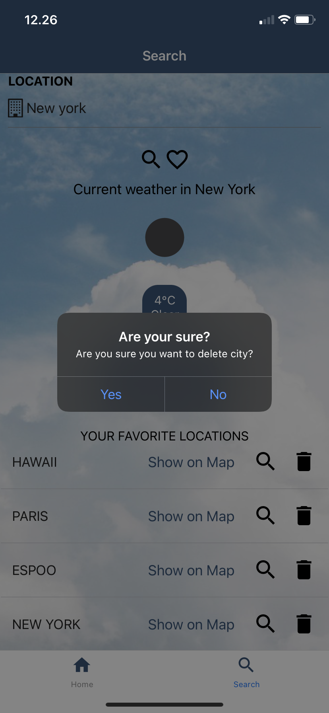

# weatherForecastApp

<!-- ABOUT THE PROJECT -->
## About

Weather Forecast is a mobile app created to help users to see their locations current weather and search weather all around the world. App fetches weather data from OpenWeather Weather API and location data to map from Mapquest Developer Geocoding API.

In Home page app fetches user's location's current weather and also shows 24 hour forecast for user's location. In Search page user can search weather by city name or by ZIP code. User can add locations to his favorite locations and also delete location from there. If user adds location to his favorite locations app will show notification. When user deletes location from favorite locations list, app will play sound. If user presses "Show on Map" button user can see his favorite location on map. In Map page app shows also weather information to that location.

Weather Forecast was created as a part of Mobile Programming course at Haaga-Helia University of Applied Sciences and it has been published on Expo Go (only works on Android): https://expo.dev/@emiliaheikonen/weatherMobileApp

Used for testing Weather Forecast: Iphone 11 and OnePlus 6T.

 

  
  
  
  
   
  
  
  
  

  
<!-- TECHNOLOGIES AND LIBRARIES -->
## Technologies and libraries
* Expo framework and platform for React Applications https://docs.expo.dev/
  * Expo Location for getting user's location https://docs.expo.dev/versions/latest/sdk/location/
  * Expo Audio for playing sound when deleting from favorite locations list https://docs.expo.dev/versions/v43.0.0/sdk/audio/
  * Expo Notifications for showing notification when user adds new city to favorite locations list https://docs.expo.dev/versions/v43.0.0/sdk/notifications/
  * Expo SQLite database for saving user's favorite locations https://docs.expo.dev/versions/v43.0.0/sdk/sqlite/
* React Navigation's Bottom-Tab and Stack navigation with additional packages it needs https://reactnavigation.org/
* React Native Maps for creating the map https://github.com/react-native-maps/react-native-maps
* React Native Elements for creating some UI elements https://reactnativeelements.com/
  * React Native Icon for showing material-community and font-awesome icons https://reactnativeelements.com/docs/icon/ 
